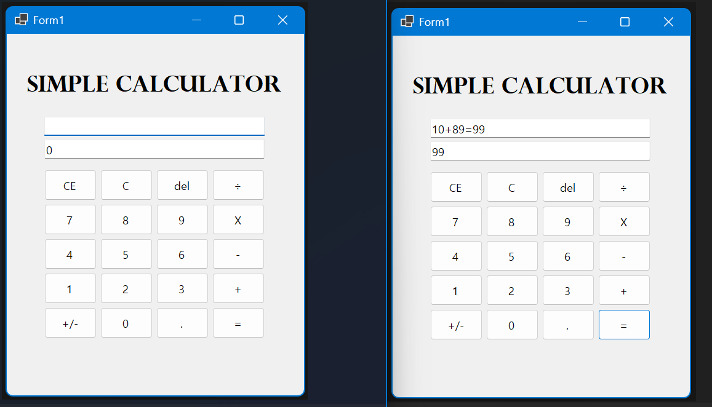
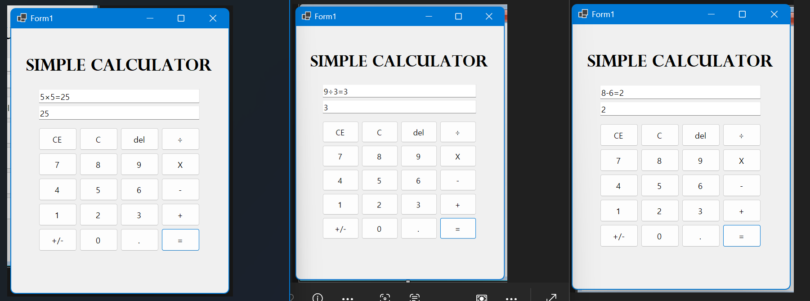
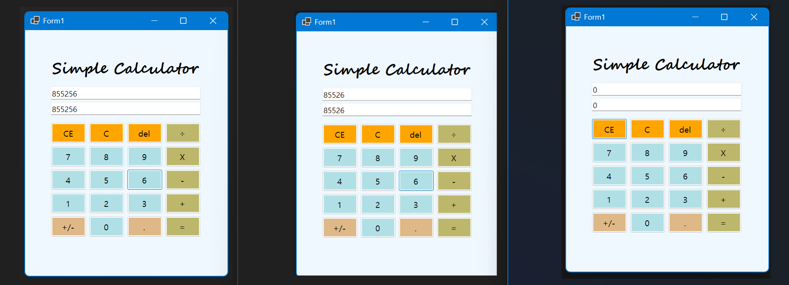
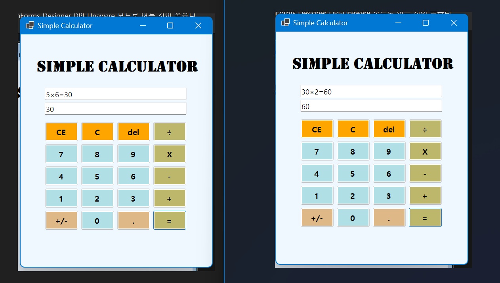

# (C# 코딩) 

# 개요
- C# 프로그래밍 학습
- 1줄 소개: C# WinForms 기본 사칙연산 계산기이며 두 텍스트박스에 각각의 표현법으로 연산이 표시된다.
- 사용한 플랫폼:
	- C#, .NET Windows Forms, Visual Studio, GitHub
- 사용한 컨트롤:
	- Label, TextBox, Button
- 사용한 기술과 구현한 기능:
	- 숫자 입력은 Number_Click 이벤트를 통해 처리되며, 버튼의 Text 값을 이용해 입력값을 누적하고, 새로운 연산 이후에는 isNewNumber 변수를 활용하여 기존 입력을 초기화한 뒤 새로운 숫자를 입력받도록 구성함. 이를 통해 사용자 입력 흐름이 자연스럽게 이어지도록 함.
	- 

## 실행 화면 (과제1)
- 과제1 코드의 실행 스크린샷

- 과제 내용
	- 계산기의 UI를 구성함.
	- 텍스트박스에 숫자가 입력되도록 함.
	- 사칙연산 중 덧셈의 기능을 추가함.
	- 계산 결과가 두 텍스트박스에 각각의 표현방법대로 나타나도록 함.

- 구현 내용과 기능 설명
	- 라벨과 텍스트박스, 버튼을 사용해 계산기 모양을 만듦.
	- btn_plus 버튼에 뎃셈 기능을 구현, btn_equal(=) 버튼을 구현함 -> int.Parse()로 문자열을 정수로 변환하고, 두 값을 + 연산한 뒤 ToString()으로 결과를 다시 문자열로 변환하여 출력함.
	- txt_mscal에는 기존 MicroSoft의 계산기처럼 연산자는 제외하고 숫자만 보이며 연산이 되도록, txtb_cal에는 연산자까지 보이며 버튼을 누르며 만든 수식 그대로가 보여지도록 함 -> Text 속성을 사용해 버튼 입력값을 누적 표시하고, 연산 과정과 최종 결과를 각각의 텍스트박스에 구분하여 출력함.

## 실행 화면 (과제1)
- 과제2 코드의 실행 스크린샷

- 과제 내용
	-

- 구현 내용과 기능 설명
	-

## 실행 화면 (과제1)
- 과제3 코드의 실행 스크린샷

- 과제 내용
	-

- 구현 내용과 기능 설명
	-

## 실행 화면 (과제1)
- 과제4 코드의 실행 스크린샷

- 과제 내용
	-

- 구현 내용과 기능 설명
	-
